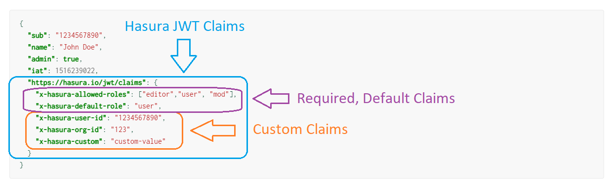

# Cloudflare Workers and Hasura

- [Cloudflare Workers and Hasura](#cloudflare-workers-and-hasura)
  - [Introduction](#introduction)
    - [Check out the Finished Product](#check-out-the-finished-product)
  - [Initial CF Worker Scaffold](#initial-cf-worker-scaffold)
  - [Initial Hasura Setup](#initial-hasura-setup)
  - [Implementing JWT Auth and Role-based Content Access via CF Workers + Hasura Actions](#implementing-jwt-auth-and-role-based-content-access-via-cf-workers--hasura-actions)
    - [Setting up Authorization in Hasura](#setting-up-authorization-in-hasura)
    - [Setting up Authentication with Cloudflare Workers](#setting-up-authentication-with-cloudflare-workers)
    - [Deploying to Cloudflare Workers](#deploying-to-cloudflare-workers)
  - [Writing a frontend, testing it all out](#writing-a-frontend-testing-it-all-out)

## Introduction

This post will give a walkthrough of how to develop a basic application using Hasura and Cloudflare workers.

**You'll learn how to:**

- Write your own JWT Auth service for authenticating users to Hasura
- Integrate it into Hasura's GraphQL API using Hasura Actions
- Deploy the auth service as a serverless function with Cloudlare Workers
- Use Hasura's permissions system to control access to records in your database
- Write a small React frontend which allows users to sign up + log in, and see private data from Hasura

By the end of it, we hope that you'll walk away with:

- A better understanding of the application of Cloudflare workers
- The fundamental Hasura knowledge to build and be productive
- A sense of accomplishment and motivation that will inspire you to take these skills, and build something awesome out of them

> Note: You can also view this content on our blog, at: https://hasura.io/blog/building-applications-with-cloudflare-workers-and-hasura-graphql-engine/

### Check out the Finished Product

**You can view the code and live frontend we'll be building, hooked up to Hasura and the CF Worker, here in your browser:**

https://codesandbox.io/s/trusting-leakey-d4u4k?file=/src/App.tsx

## Initial CF Worker Scaffold

1. Register at https://dash.cloudflare.com/sign-up/workers

   - 

2. From the Workers dashboard, follow the link to the documentation on setting up the Wrangler CLI

- 

3. Complete the steps listed, finally generating a new TypeScript worker with the command:

- 
- `$ wrangler generate my-worker https://github.com/cloudflare/worker-typescript-template`
- 

4. Inside of the `my-worker` directory that was created, run `npm install`, and then run `wrangler dev` to start the local development service
5. If you visit `http://127.0.0.1:8787`, you should see the response from the starter code like below:
   - 
   - > _Note that you can use `wrangler preview` to run your Worker against a test Cloudflare HTTPS URL to more accurately simulate a working environment:_
     - ```sh
        $ wrangler preview
        Opened a link in your default browser: https://cloudflareworkers.com/?hide_editor#35cf785b73bcdc52e3a1aaf581867ecd:https://example.com/
        Your Worker responded with: request method: GET
       ```

## Initial Hasura Setup

1. Create an account at [Hasura Cloud](https://cloud.hasura.io/login), and generate a new free-tier project


2. After the project is created, it will bring you to your project settings page. Click "Launch Dashboard" at the top right to open the Hasura web console


3. From the Hasura web console, you will be greeted with a getting-started menu. At the top of this menu, select "Connect your first Database". _(If this menu is not present, or you have dismissed it, you may also click the "DATA" tab at the top of the page)_


4. Click "Connect Database"


5. Switch tabs on the page you're navigated to, from the default "Connect existing Database" to "Create Heroku Database (Free)". Then press the "Create Database" button to automatically create and connect a Hobby-tier Heroku DB to your Hasura Cloud instance (requires a Heroku account).


## Implementing JWT Auth and Role-based Content Access via CF Workers + Hasura Actions

Now we'll look at how to use Cloudflare Workers to authenticate users and gate/control access to content in our database.

There are two things that we need to do accomplish this:

> 1. Tell Hasura what role unauthenticated/anonymous clients should be given, for use in permissions
>
> 2. Implement some form of authentication (Hasura is unopinionated about how this is done -- we just have to return a JWT token with the right claims shape)

### Setting up Authorization in Hasura

To accomplish the first part, we simply need to change an ENV variable on our Cloud instance.
Let's set `HASURA_GRAPHQL_UNAUTHORIZED_ROLE` to `anonymous` from the Cloud dashboard settings page:


Now, all requests made by users without a valid authentication token will be set to the role `anonymous` inside of Hasura.

For the second part, all we need is a Cloudflare Worker endpoint that returns a signed JSON Web Token in the shape that Hasura requires.
_> See: https://hasura.io/docs/latest/graphql/core/auth/authentication/jwt.html#the-spec for more info_

To enable JWT authentication, we have to tell Hasura about what the right signing key for our JWT is, so that it can check the validity of JWT's sent to it in `Authorization:` headers during requests.

To do this, we have to add an environment variable from the same settings page we're on now. Click the `+ New Env Var` button, and fill it out like below:


```json
{
  "type": "HS256",
  "key": "this-is-a-generic-HS256-secret-key-and-you-should-really-change-it"
}
```

Now our Hasura Cloud application is configured with the ability to authenticate users, and defaults all requests to `anonymous` unless properly auth'ed!

Lastly, we need to create a database table, and set up some permissions so that only authorized users can see it.

First, we will create our `user` table. Let's do this one with the "SQL Editor":

```sql
CREATE TABLE user (
    id int GENERATED BY DEFAULT AS IDENTITY PRIMARY KEY,
    email text NOT NULL UNIQUE,
    password text NOT NULL
);
```


Then, we'll create a table `private_table_of_awesome_stuff` in Hasura, and set permissions so that `user` can select the rows, but not anonymous:


Now to verify this, we need to insert a few test rows into `private_table_of_awesome_stuff`, and try to query it both as role `anonymous` and as role `user`:


At this point, we've successfully configured our Hasura instance with authorization and confirmed this is so!

The final step is to write & deploy our Cloudflare Worker handler that performs authentication, and then create and wire-up a small frontend to test everything is as it should be.

### Setting up Authentication with Cloudflare Workers

Integrating Authentication with Hasura is straightforward. Hasura doesn't have opinions on _**HOW**_ you authenticate clients, only the **_response object your Auth endpoint sends back_**.

Or, in less words: Hasura is flexible.

> _Note: In the case of "Webhook" mode, this will be a JSON object. In the "JWT" mode we'll be demonstrating here, this is also a JSON object -- just with a specific object key and then signed using `jwt.sign()`_

We should consult the spec for authentication in the JWT mode:

https://hasura.io/docs/latest/graphql/core/auth/authentication/jwt.html#the-spec

The important items have been hightlighted below:



Knowing this, then a basic example of a JWT auth server implementation running as a Worker, with two endpoints:

- `/signup` for registering users
- `/login` for authenticating users

Looks like the below:

```ts
import * as jwt from "jsonwebtoken"

// You would use an ENV var for this
const HASURA_ENDPOINT = "https:/<my-hasura-app>.hasura.app/v1/graphql"
// You can set up "Backend Only" mutations, or use a secret header or a service account for this
// Do not do this in a real application please
const HASURA_ADMIN_SECRET = "please-dont-actually-do-this"

const CORS_HEADERS = {
  "Access-Control-Allow-Origin": "*",
  "Access-Control-Allow-Methods": "GET,HEAD,POST,OPTIONS",
  "Access-Control-Max-Age": "86400",
}

interface User {
  id: number
  email: string
  password: string
}

////////////////////////////////////////////////////////
// AUTH STUFF
////////////////////////////////////////////////////////

function generateHasuraJWT(user: User) {
  // Really poor pseudo-example of AuthZ logic
  const isAdmin = user.email == "admin@site.com"

  const claims = {} as any
  claims["https://hasura.io/jwt/claims"] = {
    "x-hasura-allowed-roles": isAdmin ? ["admin", "user"] : ["user"],
    "x-hasura-default-role": isAdmin ? "admin" : "user",
    "x-hasura-user-id": String(user.id),
  }

  // Don't do this, read the key from an environment var via "process.env"
  const secret =
    "this-is-a-generic-HS256-secret-key-and-you-should-really-change-it"
  return jwt.sign(claims, secret, { algorithm: "HS256" })
}

////////////////////////////////////////////////////////
// ROUTE HANDLER STUFF
////////////////////////////////////////////////////////

function makeHasuraError(code: string, message: string) {
  return new Response(JSON.stringify({ message, code }), {
    status: 400,
    headers: CORS_HEADERS,
  })
}

async function handleSignup(req: Request) {
  const payload = await req.json()
  const params = payload.input.args

  // Here you would store the password hashed, you would hash-compare when logging a user in
  // params.password = await bcrypt.hash(params.password)
  const gqlRequest = await fetch(HASURA_ENDPOINT, {
    method: "POST",
    headers: {
      "Content-Type": "application/json",
      "X-Hasura-Admin-Secret": HASURA_ADMIN_SECRET,
    },
    body: JSON.stringify({
      query: `
      mutation Signup($email: String!, $password: String!) {
        insert_user_one(object: {
          email: $email,
          password: $password
        }) {
          id
          email
          password
        }
      }
      `,
      variables: {
        email: params.email,
        password: params.password,
      },
    }),
  })
  const gqlResponse = await gqlRequest.json()

  const user = gqlResponse.data.insert_user_one
  if (!user)
    return makeHasuraError(
      "auth/error-inserting-user",
      "Failed to create new user"
    )

  const jwtToken = generateHasuraJWT(user as User)
  return new Response(JSON.stringify({ token: jwtToken }), {
    status: 200,
    headers: CORS_HEADERS,
  })
}

async function handleLogin(req: Request) {
  const payload = await req.json()
  const params = payload.input.args

  const gqlRequest = await fetch(HASURA_ENDPOINT, {
    method: "POST",
    headers: {
      "Content-Type": "application/json",
      "X-Hasura-Admin-Secret": HASURA_ADMIN_SECRET,
    },
    body: JSON.stringify({
      query: `
      query FindUserByEmail($email: String!) {
        user(where: { email: { _eq: $email } }) {
          id
          email
          password
        }
      }
      `,
      variables: {
        email: params.email,
      },
    }),
  })
  const gqlResponse = await gqlRequest.json()

  const user = gqlResponse.data.user[0]
  // if (!user) <handle case of no user created and return an error here>
  // check that user.password (hashed) successfully compares against plaintext password
  if (params.password != user.password)
    return makeHasuraError("auth/invalid-credentials", "Wrong credentials")

  const jwtToken = generateHasuraJWT(user as User)
  return new Response(JSON.stringify({ token: jwtToken }), {
    status: 200,
    headers: CORS_HEADERS,
  })
}

////////////////////////////////////////////////////////
// MAIN
////////////////////////////////////////////////////////

export async function handleRequest(request: Request): Promise<Response> {
  const url = new URL(request.url)
  console.log("url.pathname=", url.pathname)

  switch (url.pathname) {
    case "/signup":
      return handleSignup(request)
    case "/login":
      return handleLogin(request)
    default:
      return new Response(`request method: ${request.method}`, {
        status: 200,
        headers: CORS_HEADERS,
      })
  }
}
```

As a test that this is working, we can send requests to the `/signup` and `/login` endpoints.

> You can use `curl`/`wget` to do this, or Postman/Insomnia etc., but here we'll just use a browser devtools and `fetch()` to make the request:

- Ensure that your local Worker is still running via `wrangler dev`
- Run the following in your browser devtools
  - ```js
    var req = await fetch("http://127.0.0.1:8787/signup", {
      method: "POST",
      headers: {
        contentType: "application/json",
      },
      body: JSON.stringify({
        input: {
          args: {
            email: "newuser@site.com",
            password: "mypassword",
          },
        },
      }),
    })
    var res = await req.json()
    console.log(res)
    ```
  - ```js
    var req = await fetch("http://127.0.0.1:8787/login", {
      method: "POST",
      headers: {
        contentType: "application/json",
      },
      body: JSON.stringify({
        input: {
          args: {
            email: "newuser@site.com",
            password: "mypassword",
          },
        },
      }),
    })
    var res = await req.json()
    console.log(res)
    ```
  - ```js
    var req = await fetch("http://127.0.0.1:8787/login", {
      method: "POST",
      headers: {
        contentType: "application/json",
      },
      body: JSON.stringify({
        input: {
          args: {
            email: "newuser@site.com",
            password: "WRONGPASSWORD",
          },
        },
      }),
    })
    var res = await req.json()
    console.log(res)
    ```

You should get:

- 
- 

### Deploying to Cloudflare Workers

To deploy your working API and turn it into a live, production endpoint, we just need to use the Wrangler CLI to run the `publish` command.
That looks like this (run from inside of the directory containing your Worker code and TOML config):

```sh
$ wrangler publish
```

> Note: You'll need to make sure that you have authenticated using the Wrangler CLI which will configure your `wrangler.toml` with necessary values
> To do this, you can run `wrangler login`, and then `wrangler whoami` to verify your credentials are correct

## Writing a frontend, testing it all out

Below is an overly-simplified example of frontend code that consumes this CF Worker auth API and uses the JWT bearer token to authenticate the client to Hasura, to fetch private data.

```ts
import React, { useEffect, useRef, useState } from "react"
import "./App.css"

const HASURA_ENDPOINT = "https://<your-cloud-app>.hasura.app/v1/graphql"

function App() {
  const form = useRef(null)
  const [jwt, setJWT] = useState("")
  const [isLoggingIn, setIsLoggingIn] = useState(false)
  const [isSigningUp, setIsSigningUp] = useState(false)
  const [privateStuff, setPrivateStuff] = useState<any>([])

  useEffect(() => {
    if (!jwt) return
    fetchPrivateStuff().then(setPrivateStuff)
  }, [jwt])

  async function signup(email: string, password: string) {
    const req = await fetch(HASURA_ENDPOINT, {
      method: "POST",
      headers: {
        "Content-Type": "application/json",
      },
      body: JSON.stringify({
        query: `
          mutation Signup($email: String!, $password: String!) {
            signup(args: { email: $email, password: $password }) {
              token
            }
          }
        `,
        variables: {
          email,
          password,
        },
      }),
    })
    const res = await req.json()
    const token = res?.data?.signup?.token
    if (!token) alert("Signup failed")
    setJWT(token)
  }

  async function login(email: string, password: string) {
    const req = await fetch(HASURA_ENDPOINT, {
      method: "POST",
      headers: {
        "Content-Type": "application/json",
      },
      body: JSON.stringify({
        query: `
          mutation Login($email: String!, $password: String!) {
            login(args: { email: $email, password: $password }) {
              token
            }
          }
        `,
        variables: {
          email,
          password,
        },
      }),
    })
    const res = await req.json()
    const token = res?.data?.login?.token
    if (!token) alert("Login failed")
    setJWT(token)
  }

  async function fetchPrivateStuff() {
    const req = await fetch(HASURA_ENDPOINT, {
      method: "POST",
      headers: {
        Authorization: `Bearer ${jwt}`,
        "Content-Type": "application/json",
      },
      body: JSON.stringify({
        query: `
        query AllPrivateStuff {
          private_table_of_awesome_stuff {
            id
            something
          }
        }
        `,
      }),
    })
    const res = await req.json()
    const data = res?.data?.private_table_of_awesome_stuff
    if (!data) alert("Couldn't retrieve any records")
    return data
  }

  if (!jwt) {
    if (isSigningUp || isLoggingIn)
      return (
        <form
          ref={form}
          onSubmit={(e) => {
            e.preventDefault()
            const data = new FormData(form.current!)
            const email = data.get("email") as string
            const password = data.get("password") as string
            if (isLoggingIn) return login(email, password)
            if (isSigningUp) return signup(email, password)
          }}
        >
          <input name="email" type="email" placeholder="email" />
          <input name="password" type="password" placeholder="password" />
          <button type="submit">Submit</button>
        </form>
      )
    else
      return (
        <div>
          <p>Please sign up or log in</p>
          <button onClick={() => setIsSigningUp(true)}>
            Click here to sign up
          </button>
          <button onClick={() => setIsLoggingIn(true)}>
            Click here to log in
          </button>
        </div>
      )
  }

  return (
    <div>
      <p>Here is a list of private stuff only authenticated users can see:</p>
      <ul>
        {privateStuff?.map((it: any) => (
          <li>
            {it.id}: {it.something}
          </li>
        ))}
      </ul>
    </div>
  )
}

export default App
```

If we run this, and then sign up/log in as a user, we should see:


And we can use the Hasura web console (by entering this same value for the `Authorization` header, and then clicking the `inspect`/`decode` icon that shows on the far-right) to look at the claims of our token:


